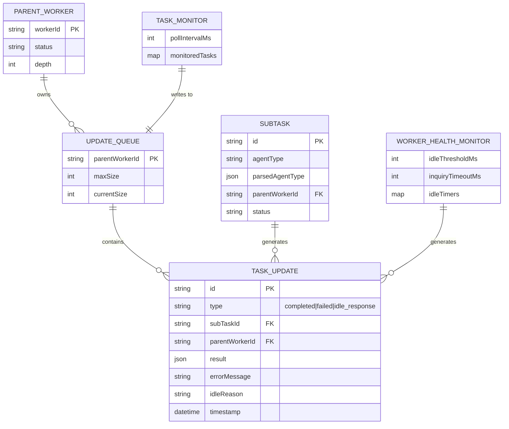

# Fix Agent Spawning, Async Task Monitoring & Idle Handling

## Overview

This plan addresses three critical bugs in the multi-agent orchestration system:

1. **Agent Type Propagation Bug** - Child agents spawn as parent type (orchestrator) instead of requested specialist type
2. **Blocking Parallel Execution** - Parent blocks waiting for ALL tasks instead of processing updates incrementally
3. **Idle Child Handling** - Idle children incorrectly marked as completed instead of being queried

**Key Insight**: These bugs are interconnected. The queue infrastructure (Problem 2) is required for proper idle handling (Problem 3). Agent type (Problem 1) is independent and should be fixed first.

---

## Problem Analysis

### Problem 1: Agent Type Propagation Bug

**Current Behavior (Broken)**:
```
Orchestrator spawns "coder" task
  → SubTaskManager.createSubTask(agentType: "coder")
  → ISubTask.agentType = "coder" (string stored correctly)
  → _executeSubTaskWithOrchestratorUI() passes agent: "coder"
  → orchestratorService.addTask() creates WorkerTask with agent: "coder"
  → BUT: When deploying, executor selection uses WRONG logic
  → Child spawns as orchestrator, not coder
```

**Root Cause Investigation**:
- `src/extension/orchestrator/subTaskManager.ts:325-442` - executes subtasks
- `src/extension/orchestrator/orchestratorServiceV2.ts:260+` - deploy() method
- `src/extension/orchestrator/agentTypeParser.ts:86-94` - parses agent types
- `src/extension/orchestrator/executors/` - executor selection

**Specific Bug**: When orchestrator spawns a subtask, the `agentType` string is preserved, but the executor resolution defaults to the parent's executor type when the string doesn't include a backend prefix.

### Problem 2: Blocking Parallel Execution

**Current Behavior (Broken)**:
```typescript
// In A2ASpawnParallelSubTasksTool
const results = await Promise.all(
  tasks.map(task => this._subTaskManager.executeSubTask(task.id, token))
);
// Parent BLOCKED here until ALL complete
return results;
```

**Desired Behavior**:
```
Parent spawns 3 tasks → Returns immediately with task IDs
Monitor process polls every ~5s → Detects Task 1 complete at T+30s
Queue update pushed to parent → Parent processes at next pause
Parent continues work → Receives Task 2 complete at T+60s
... and so on
```

**Key Files**:
- `src/extension/tools/node/a2aTools.ts:444+` - A2ASpawnParallelSubTasksTool
- `src/extension/orchestrator/orchestratorQueue.ts:127+` - Message queue system
- `src/extension/conversation/a2a/messageQueue.ts` - A2A message queue

### Problem 3: Idle Child Handling

**Current Behavior (Broken)**:
```
Child agent goes idle → Marked as "completed" automatically
Parent never knows child was confused/stuck → Data/work lost
```

**Desired Behavior**:
```
Child agent goes idle → Send inquiry: "Why are you idle? What's missing?"
Child responds → Response queued for parent
Same for errors → Queue error update, don't fail silently
```

**Key Files**:
- `src/extension/orchestrator/workerSession.ts:384+` - Worker state management
- `src/extension/orchestrator/workerHealthMonitor.ts` - Health monitoring

---

## Implementation Plan

### Phase 1: Fix Agent Type Propagation (CRITICAL - Fix First)

**Goal**: When orchestrator spawns `@coder`, child MUST be `@coder` with coding tools.

#### 1.1 Diagnose Current Flow

**File**: `src/extension/orchestrator/subTaskManager.ts`

```typescript
// Current: agentType is just a string
interface ISubTask {
  agentType: string; // "coder" - loses backend context!
}

// Need: Full parsed type
interface ISubTask {
  agentType: string;
  parsedAgentType?: ParsedAgentType; // Preserve backend info
}
```

#### 1.2 Fix SubTask Creation

**File**: `src/extension/orchestrator/subTaskManager.ts`

```typescript
// subTaskManager.ts - modify createSubTask

createSubTask(options: ISubTaskCreateOptions): ISubTask {
  const { agentType, prompt, expectedOutput, targetFiles } = options;

  // Parse agent type ONCE at creation, preserve result
  const parsedType = parseAgentType(agentType);

  // Validate agent type is supported
  if (!this._executorRegistry.hasExecutor(parsedType)) {
    throw new Error(
      `Invalid agent type "${agentType}". ` +
      `Available types: ${this._executorRegistry.getAvailableTypes().join(', ')}`
    );
  }

  const subTask: ISubTask = {
    id: generateId(),
    agentType,
    parsedAgentType: parsedType, // NEW: Preserve parsed type
    prompt,
    expectedOutput,
    targetFiles,
    parentWorkerId: this._workerContext.workerId,
    depth: this._workerContext.depth + 1,
    status: 'pending',
  };

  return subTask;
}
```

#### 1.3 Fix Executor Selection During Deploy

**File**: `src/extension/orchestrator/orchestratorServiceV2.ts`

```typescript
// orchestratorServiceV2.ts - modify deploy()

async deploy(taskId: string): Promise<void> {
  const task = this._tasks.get(taskId);
  if (!task) throw new Error(`Task ${taskId} not found`);

  // Use parsed type from subtask if available, otherwise parse fresh
  let parsedType: ParsedAgentType;
  if (task.parsedAgentType) {
    parsedType = task.parsedAgentType;
  } else if (task.agent) {
    parsedType = parseAgentType(task.agent);
  } else {
    // Default to generic @agent if no type specified
    parsedType = { backend: 'copilot', agentName: 'agent' };
  }

  // Get correct executor for THIS agent type (not parent's!)
  const executor = this._executorRegistry.getExecutor(parsedType);
  if (!executor) {
    throw new Error(`No executor found for agent type: ${task.agent}`);
  }

  // Create worker with correct agent type
  const worker = new WorkerSession({
    id: task.workerId,
    taskId: task.id,
    agentType: parsedType, // Pass parsed type, not string
    // ... other options
  });

  // Execute with correct tools for agent type
  await executor.execute({
    taskId: task.id,
    agentType: parsedType,
    // ... other params
  });
}
```

#### 1.4 Ensure Tool Set Matches Agent Type

**File**: `src/extension/orchestrator/workerToolsService.ts`

```typescript
// workerToolsService.ts - modify createWorkerToolSet

createWorkerToolSet(
  workerId: string,
  worktreePath: string,
  agentType: ParsedAgentType, // Accept parsed type
  // ... other params
): IWorkerToolSet {
  // Get tools defined in agent's .agent.md file
  const agentDefinition = this._loadAgentDefinition(agentType.agentName);
  const allowedTools = agentDefinition.tools || [];

  // Create tool set filtered to agent's allowed tools
  const toolSet = new WorkerToolSet(
    workerId,
    worktreePath,
    allowedTools, // Only tools this agent type should have
    // ... other params
  );

  return toolSet;
}
```

#### 1.5 Add Validation Tests

```typescript
// test/orchestrator/agentTypeSpawning.test.ts

describe('Agent Type Spawning', () => {
  it('should spawn @coder with coding tools when orchestrator requests coder', async () => {
    const orchestrator = createOrchestratorAgent();

    // Orchestrator spawns a coder subtask
    const subtask = await orchestrator.spawnSubTask({
      agentType: '@coder',
      prompt: 'Implement the feature'
    });

    // Verify child is actually a coder
    expect(subtask.parsedAgentType.agentName).toBe('coder');
    expect(subtask.executor).toBeInstanceOf(CopilotAgentExecutor);

    // Verify coder has coding tools
    const tools = subtask.toolSet.getAvailableTools();
    expect(tools).toContain('edit_file');
    expect(tools).toContain('create_file');
  });

  it('should spawn claude:reviewer with Claude backend when requested', async () => {
    const orchestrator = createOrchestratorAgent();

    const subtask = await orchestrator.spawnSubTask({
      agentType: 'claude:reviewer',
      prompt: 'Review this code'
    });

    expect(subtask.parsedAgentType.backend).toBe('claude');
    expect(subtask.parsedAgentType.agentName).toBe('reviewer');
    expect(subtask.executor).toBeInstanceOf(ClaudeCodeAgentExecutor);
  });

  it('should NOT inherit parent type when spawning different agent', async () => {
    const orchestrator = createOrchestratorAgent(); // type: @orchestrator

    const subtask = await orchestrator.spawnSubTask({
      agentType: '@researcher',
      prompt: 'Research this codebase'
    });

    // Must NOT be orchestrator
    expect(subtask.parsedAgentType.agentName).not.toBe('orchestrator');
    expect(subtask.parsedAgentType.agentName).toBe('researcher');
  });
});
```

**Tasks - Phase 1**:
- [ ] Add `parsedAgentType: ParsedAgentType` to `ISubTask` interface
- [ ] Modify `SubTaskManager.createSubTask()` to parse and store agent type
- [ ] Modify `OrchestratorService.deploy()` to use stored `parsedAgentType`
- [ ] Modify `WorkerToolsService.createWorkerToolSet()` to filter tools by agent type
- [ ] Add validation to reject invalid agent types at spawn time
- [ ] Write tests for correct agent type propagation
- [ ] Test: Spawn @coder from orchestrator → Verify coding tools available
- [ ] Test: Spawn claude:reviewer → Verify Claude executor used

**Files to Modify**:
- `src/extension/orchestrator/orchestratorInterfaces.ts` - Add parsedAgentType to ISubTask
- `src/extension/orchestrator/subTaskManager.ts:169+` - createSubTask
- `src/extension/orchestrator/orchestratorServiceV2.ts:260+` - deploy
- `src/extension/orchestrator/workerToolsService.ts:148+` - createWorkerToolSet

**Estimated LOC**: ~100 lines

---

### Phase 2: Non-Blocking Parallel Execution with Monitoring

**Goal**: Parent spawns tasks, continues working, receives updates via queue.

#### 2.1 Create Task Monitor Service

**New File**: `src/extension/orchestrator/taskMonitorService.ts`

```typescript
import { Disposable, Emitter, Event } from 'vs/base/common/lifecycle';
import { ISubTaskManager, ISubTask } from './orchestratorInterfaces';
import { ILogService } from 'vs/platform/log/common/log';

interface ITaskUpdate {
  type: 'completed' | 'failed' | 'idle' | 'progress';
  subTaskId: string;
  parentWorkerId: string;
  result?: ISubTaskResult;
  error?: Error;
  idleReason?: string;
  timestamp: number;
}

interface IParentUpdateQueue {
  workerId: string;
  updates: ITaskUpdate[];
  maxSize: number;
}

export interface ITaskMonitorService {
  // Register a parent to receive updates
  registerParent(workerId: string): void;
  unregisterParent(workerId: string): void;

  // Get pending updates for a parent (and clear them)
  consumeUpdates(workerId: string): ITaskUpdate[];

  // Check if parent has pending updates
  hasPendingUpdates(workerId: string): boolean;

  // Events
  onUpdateAvailable: Event<{ workerId: string; count: number }>;
}

export class TaskMonitorService extends Disposable implements ITaskMonitorService {
  private readonly _parentQueues = new Map<string, IParentUpdateQueue>();
  private readonly _monitoredTasks = new Map<string, string>(); // subTaskId -> parentWorkerId
  private readonly _pollInterval = 5000; // 5 seconds
  private _pollHandle?: NodeJS.Timeout;

  private readonly _onUpdateAvailable = this._register(new Emitter<{ workerId: string; count: number }>());
  public readonly onUpdateAvailable = this._onUpdateAvailable.event;

  constructor(
    @ISubTaskManager private readonly _subTaskManager: ISubTaskManager,
    @ILogService private readonly _logService: ILogService,
  ) {
    super();
    this._startPolling();

    // Also listen to completion events (event-driven where possible)
    this._register(this._subTaskManager.onDidCompleteSubTask(subTask => {
      this._handleSubTaskComplete(subTask);
    }));
  }

  registerParent(workerId: string): void {
    if (!this._parentQueues.has(workerId)) {
      this._parentQueues.set(workerId, {
        workerId,
        updates: [],
        maxSize: 100, // Configurable limit
      });
      this._logService.debug(`[TaskMonitor] Registered parent: ${workerId}`);
    }
  }

  unregisterParent(workerId: string): void {
    this._parentQueues.delete(workerId);

    // Clean up monitored tasks for this parent
    for (const [subTaskId, parentId] of this._monitoredTasks) {
      if (parentId === workerId) {
        this._monitoredTasks.delete(subTaskId);
      }
    }
    this._logService.debug(`[TaskMonitor] Unregistered parent: ${workerId}`);
  }

  startMonitoring(subTaskId: string, parentWorkerId: string): void {
    this._monitoredTasks.set(subTaskId, parentWorkerId);
    this._logService.debug(`[TaskMonitor] Monitoring subtask ${subTaskId} for parent ${parentWorkerId}`);
  }

  consumeUpdates(workerId: string): ITaskUpdate[] {
    const queue = this._parentQueues.get(workerId);
    if (!queue) return [];

    const updates = [...queue.updates];
    queue.updates = []; // Clear after consuming
    return updates;
  }

  hasPendingUpdates(workerId: string): boolean {
    const queue = this._parentQueues.get(workerId);
    return queue ? queue.updates.length > 0 : false;
  }

  private _startPolling(): void {
    this._pollHandle = setInterval(() => {
      this._pollSubTaskStatuses();
    }, this._pollInterval);

    this._register({
      dispose: () => {
        if (this._pollHandle) {
          clearInterval(this._pollHandle);
        }
      }
    });
  }

  private _pollSubTaskStatuses(): void {
    for (const [subTaskId, parentWorkerId] of this._monitoredTasks) {
      const subTask = this._subTaskManager.getSubTask(subTaskId);
      if (!subTask) {
        // Task no longer exists, clean up
        this._monitoredTasks.delete(subTaskId);
        continue;
      }

      // Check for status changes that weren't caught by events
      if (subTask.status === 'completed' || subTask.status === 'failed') {
        this._queueUpdate(parentWorkerId, {
          type: subTask.status === 'completed' ? 'completed' : 'failed',
          subTaskId,
          parentWorkerId,
          result: subTask.result,
          error: subTask.error,
          timestamp: Date.now(),
        });
        this._monitoredTasks.delete(subTaskId);
      }
    }
  }

  private _handleSubTaskComplete(subTask: ISubTask): void {
    const parentWorkerId = this._monitoredTasks.get(subTask.id);
    if (!parentWorkerId) return;

    this._queueUpdate(parentWorkerId, {
      type: 'completed',
      subTaskId: subTask.id,
      parentWorkerId,
      result: subTask.result,
      timestamp: Date.now(),
    });

    this._monitoredTasks.delete(subTask.id);
  }

  private _queueUpdate(parentWorkerId: string, update: ITaskUpdate): void {
    const queue = this._parentQueues.get(parentWorkerId);
    if (!queue) {
      this._logService.warn(`[TaskMonitor] No queue for parent ${parentWorkerId}, update dropped`);
      return;
    }

    // Check queue size limit
    if (queue.updates.length >= queue.maxSize) {
      this._logService.warn(`[TaskMonitor] Queue full for ${parentWorkerId}, dropping oldest update`);
      queue.updates.shift();
    }

    queue.updates.push(update);
    this._logService.debug(`[TaskMonitor] Queued ${update.type} update for ${parentWorkerId}`);

    // Fire event
    this._onUpdateAvailable.fire({
      workerId: parentWorkerId,
      count: queue.updates.length,
    });
  }
}
```

#### 2.2 Modify Parallel Spawn Tool for Non-Blocking

**File**: `src/extension/tools/node/a2aTools.ts`

```typescript
// Modify A2ASpawnParallelSubTasksTool

class A2ASpawnParallelSubTasksTool {
  constructor(
    // ... existing deps
    @ITaskMonitorService private readonly _taskMonitor: ITaskMonitorService,
  ) {}

  async invoke(params: SpawnParallelParams): Promise<ToolResult> {
    const { tasks, blocking = false } = params; // Default to non-blocking

    // Register parent to receive updates
    const parentWorkerId = this._workerContext.workerId;
    this._taskMonitor.registerParent(parentWorkerId);

    // Create all subtasks
    const subTasks: ISubTask[] = [];
    for (const taskDef of tasks) {
      const subTask = this._subTaskManager.createSubTask({
        agentType: taskDef.agentType,
        prompt: taskDef.prompt,
        expectedOutput: taskDef.expectedOutput,
        targetFiles: taskDef.targetFiles,
      });
      subTasks.push(subTask);

      // Register for monitoring
      this._taskMonitor.startMonitoring(subTask.id, parentWorkerId);
    }

    if (blocking) {
      // Old behavior: wait for all
      const results = await Promise.all(
        subTasks.map(st => this._subTaskManager.executeSubTask(st.id, this._token))
      );
      return {
        status: 'success',
        results,
      };
    }

    // NEW: Non-blocking - start all tasks without waiting
    for (const subTask of subTasks) {
      // Fire and forget - don't await
      this._subTaskManager.executeSubTask(subTask.id, this._token)
        .catch(err => {
          this._logService.error(`[A2ASpawnParallel] Task ${subTask.id} failed: ${err}`);
          // Error is handled via monitor queue
        });
    }

    return {
      status: 'success',
      message: `Started ${subTasks.length} parallel tasks. Results will arrive in your update queue.`,
      subTaskIds: subTasks.map(st => st.id),
      instruction: 'Continue with other work. Use a2a_check_updates periodically to get completed task results.',
    };
  }
}
```

#### 2.3 Create Update Consumption Tool

**New File**: `src/extension/tools/node/a2aCheckUpdatesTool.ts`

```typescript
import { Tool, ToolResult } from '../tool';
import { ITaskMonitorService, ITaskUpdate } from '../../orchestrator/taskMonitorService';

interface CheckUpdatesParams {
  /** Optional: only get updates for specific subtask IDs */
  subTaskIds?: string[];
}

export class A2ACheckUpdatesTool extends Tool {
  name = 'a2a_check_updates';
  description = `Check for updates from spawned subtasks.

Use this tool to:
- Get results from completed subtasks
- See error details from failed subtasks
- Check on subtask progress

This tool returns ALL pending updates and clears them.
Call regularly while subtasks are running.`;

  constructor(
    @ITaskMonitorService private readonly _taskMonitor: ITaskMonitorService,
    @IWorkerContext private readonly _workerContext: IWorkerContext,
  ) {
    super();
  }

  async invoke(params: CheckUpdatesParams): Promise<ToolResult> {
    const updates = this._taskMonitor.consumeUpdates(this._workerContext.workerId);

    if (updates.length === 0) {
      return {
        status: 'success',
        message: 'No updates available. Your subtasks are still running.',
        updates: [],
      };
    }

    // Filter by requested subtask IDs if provided
    let filteredUpdates = updates;
    if (params.subTaskIds && params.subTaskIds.length > 0) {
      filteredUpdates = updates.filter(u => params.subTaskIds!.includes(u.subTaskId));
    }

    // Format updates for agent consumption
    const formattedUpdates = filteredUpdates.map(update => ({
      subTaskId: update.subTaskId,
      status: update.type,
      result: update.result?.content,
      error: update.error?.message,
      timestamp: new Date(update.timestamp).toISOString(),
    }));

    const completedCount = filteredUpdates.filter(u => u.type === 'completed').length;
    const failedCount = filteredUpdates.filter(u => u.type === 'failed').length;

    return {
      status: 'success',
      message: `${completedCount} completed, ${failedCount} failed, ${filteredUpdates.length} total updates.`,
      updates: formattedUpdates,
    };
  }
}
```

#### 2.4 Inject Update Check Into Agent Loop

**File**: `src/extension/orchestrator/agentRunner.ts`

```typescript
// agentRunner.ts - modify the agent execution loop

async _runAgentLoop(options: IAgentRunOptions): Promise<IAgentRunResult> {
  while (!this._token.isCancellationRequested) {
    // BEFORE each tool call: check for updates
    if (this._taskMonitor.hasPendingUpdates(this._workerId)) {
      const updates = this._taskMonitor.consumeUpdates(this._workerId);

      // Inject updates into agent's context
      this._injectSystemMessage(`
## Subtask Updates Received

${updates.map(u => this._formatUpdateForAgent(u)).join('\n\n')}

Review these results and decide your next action.
`);
    }

    // Continue with normal tool loop
    const response = await this._model.generate(this._buildPrompt());

    if (response.toolCalls?.length > 0) {
      // Process tool calls...
      await this._processToolCalls(response.toolCalls);
    } else {
      // No more tool calls, agent is done
      break;
    }
  }
}

private _formatUpdateForAgent(update: ITaskUpdate): string {
  switch (update.type) {
    case 'completed':
      return `**Subtask ${update.subTaskId} COMPLETED**
Result: ${update.result?.content || 'No result content'}`;

    case 'failed':
      return `**Subtask ${update.subTaskId} FAILED**
Error: ${update.error?.message || 'Unknown error'}
You may want to retry or adjust your approach.`;

    case 'idle':
      return `**Subtask ${update.subTaskId} went IDLE**
Reason: ${update.idleReason || 'Unknown'}
The subtask agent is waiting. Consider sending it more information.`;

    default:
      return `**Subtask ${update.subTaskId}: ${update.type}**`;
  }
}
```

**Tasks - Phase 2**:
- [ ] Create `ITaskMonitorService` interface and implementation
- [ ] Add 5-second polling loop with cleanup on dispose
- [ ] Implement parent queue with size limits
- [ ] Modify `A2ASpawnParallelSubTasksTool` for non-blocking mode
- [ ] Create `A2ACheckUpdatesTool` for explicit update consumption
- [ ] Inject update checks into agent execution loop
- [ ] Add `onUpdateAvailable` event for reactive handling
- [ ] Test: Spawn 3 parallel tasks → Parent continues → Updates arrive correctly
- [ ] Test: Queue overflow handling
- [ ] Test: Parent unregistration cleans up monitoring

**Files to Create**:
- `src/extension/orchestrator/taskMonitorService.ts`
- `src/extension/tools/node/a2aCheckUpdatesTool.ts`

**Files to Modify**:
- `src/extension/tools/node/a2aTools.ts:444+` - A2ASpawnParallelSubTasksTool
- `src/extension/orchestrator/agentRunner.ts` - inject update checks
- `src/extension/orchestrator/services.ts` - register TaskMonitorService

**Estimated LOC**: ~300 lines

---

### Phase 3: Idle Child Handling with Inquiry

**Goal**: When child goes idle, send inquiry instead of marking complete.

#### 3.1 Define Idle Detection Criteria

**File**: `src/extension/orchestrator/idleDetector.ts`

```typescript
export interface IIdleDetectionConfig {
  /** Time in ms after last activity to consider worker idle */
  idleThresholdMs: number; // Default: 30000 (30 seconds)

  /** Grace period before sending inquiry */
  inquiryDelayMs: number; // Default: 5000 (5 seconds)

  /** Timeout waiting for inquiry response */
  inquiryTimeoutMs: number; // Default: 60000 (60 seconds)
}

export const DEFAULT_IDLE_CONFIG: IIdleDetectionConfig = {
  idleThresholdMs: 30000,
  inquiryDelayMs: 5000,
  inquiryTimeoutMs: 60000,
};

export interface IIdleEvent {
  workerId: string;
  idleDurationMs: number;
  lastActivity: {
    type: 'tool_call' | 'message' | 'init';
    timestamp: number;
    details?: string;
  };
  workerStatus: WorkerStatus;
}
```

#### 3.2 Implement Idle Detection

**File**: `src/extension/orchestrator/workerHealthMonitor.ts`

```typescript
// Modify existing WorkerHealthMonitor

export class WorkerHealthMonitor extends Disposable {
  private readonly _idleTimers = new Map<string, NodeJS.Timeout>();

  private _monitorWorkerActivity(worker: WorkerSession): void {
    // Track last activity
    this._register(worker.onToolCall(() => {
      this._resetIdleTimer(worker.id);
    }));

    this._register(worker.onMessage(() => {
      this._resetIdleTimer(worker.id);
    }));

    // Start idle timer
    this._startIdleTimer(worker.id);
  }

  private _resetIdleTimer(workerId: string): void {
    const existing = this._idleTimers.get(workerId);
    if (existing) {
      clearTimeout(existing);
    }
    this._startIdleTimer(workerId);
  }

  private _startIdleTimer(workerId: string): void {
    const timer = setTimeout(() => {
      this._handlePotentiallyIdleWorker(workerId);
    }, this._config.idleThresholdMs);

    this._idleTimers.set(workerId, timer);
  }

  private async _handlePotentiallyIdleWorker(workerId: string): Promise<void> {
    const worker = this._workers.get(workerId);
    if (!worker) return;

    // Don't consider idle if:
    // - Worker is actively running a tool
    // - Worker is waiting for approval
    // - Worker has explicitly completed
    if (
      worker.status === 'running' ||
      worker.status === 'waiting-approval' ||
      worker.status === 'completed'
    ) {
      return;
    }

    // Worker appears to be idle
    this._logService.info(`[WorkerHealthMonitor] Worker ${workerId} appears idle`);

    // Don't auto-complete! Send inquiry instead.
    await this._sendIdleInquiry(worker);
  }

  private async _sendIdleInquiry(worker: WorkerSession): Promise<void> {
    const inquiryMessage = `
You appear to be idle. Please respond with one of the following:

1. If you have completed your task: Call the a2a_subtask_complete tool with your results.

2. If you are blocked and need information: Describe what you need and I will help.

3. If you encountered an error: Describe what went wrong.

4. If you are still working: Describe what you are currently doing.

Do not remain silent. Your parent task is waiting for your status.
`;

    // Send message to worker
    await this._orchestratorService.sendMessageToWorker(worker.id, inquiryMessage);

    // Start inquiry response timeout
    const timeoutHandle = setTimeout(() => {
      this._handleInquiryTimeout(worker.id);
    }, this._config.inquiryTimeoutMs);

    // Listen for response
    const responseDisposable = worker.onMessage(message => {
      clearTimeout(timeoutHandle);
      responseDisposable.dispose();
      this._handleIdleInquiryResponse(worker.id, message);
    });

    // Store for cleanup
    this._pendingInquiries.set(worker.id, {
      timeoutHandle,
      responseDisposable,
    });
  }

  private _handleIdleInquiryResponse(workerId: string, response: string): void {
    // Queue the response as an update for the parent
    const worker = this._workers.get(workerId);
    if (!worker) return;

    this._taskMonitor.queueIdleResponse(worker.parentWorkerId, {
      type: 'idle_response',
      subTaskId: worker.taskId,
      parentWorkerId: worker.parentWorkerId,
      idleReason: response,
      timestamp: Date.now(),
    });

    this._logService.info(`[WorkerHealthMonitor] Idle response from ${workerId}: ${response.slice(0, 100)}...`);
  }

  private _handleInquiryTimeout(workerId: string): void {
    // Worker didn't respond to inquiry - mark as failed
    const worker = this._workers.get(workerId);
    if (!worker) return;

    this._logService.warn(`[WorkerHealthMonitor] Worker ${workerId} unresponsive to inquiry`);

    // Queue failure update
    this._taskMonitor.queueUpdate(worker.parentWorkerId, {
      type: 'failed',
      subTaskId: worker.taskId,
      parentWorkerId: worker.parentWorkerId,
      error: new Error('Worker became unresponsive after idle inquiry'),
      timestamp: Date.now(),
    });

    // Clean up worker
    this._orchestratorService.cancelWorker(workerId);
  }
}
```

#### 3.3 Error Handling - Queue Instead of Silent Fail

**File**: `src/extension/orchestrator/subTaskManager.ts`

```typescript
// subTaskManager.ts - modify executeSubTask

async executeSubTask(id: string, token: CancellationToken): Promise<ISubTaskResult> {
  const subTask = this._subTasks.get(id);
  if (!subTask) {
    throw new Error(`SubTask ${id} not found`);
  }

  try {
    subTask.status = 'running';
    this._onDidChangeSubTask.fire(subTask);

    const result = await this._executeSubTaskWithOrchestratorUI(subTask, token);

    subTask.status = 'completed';
    subTask.result = result;
    this._onDidCompleteSubTask.fire(subTask);

    return result;

  } catch (error) {
    // DON'T just throw - queue error for parent
    subTask.status = 'failed';
    subTask.error = error as Error;

    // Queue error update for parent
    this._taskMonitor.queueUpdate(subTask.parentWorkerId, {
      type: 'failed',
      subTaskId: subTask.id,
      parentWorkerId: subTask.parentWorkerId,
      error: error as Error,
      timestamp: Date.now(),
    });

    this._onDidCompleteSubTask.fire(subTask); // Fire even on failure

    // Log but don't crash
    this._logService.error(`[SubTaskManager] Task ${id} failed: ${error}`);

    return {
      status: 'failed',
      error: (error as Error).message,
    };
  }
}
```

**Tasks - Phase 3**:
- [ ] Define `IIdleDetectionConfig` with configurable thresholds
- [ ] Add idle timer tracking per worker in `WorkerHealthMonitor`
- [ ] Implement `_sendIdleInquiry()` method
- [ ] Add inquiry response timeout handling
- [ ] Queue idle responses as updates for parent
- [ ] Modify error handling to queue instead of throw
- [ ] Test: Child goes idle → Inquiry sent → Response queued
- [ ] Test: Inquiry timeout → Worker cancelled, failure queued
- [ ] Test: Error during execution → Error queued for parent

**Files to Modify**:
- `src/extension/orchestrator/workerHealthMonitor.ts` - idle detection
- `src/extension/orchestrator/subTaskManager.ts:325-442` - error queueing
- `src/extension/orchestrator/orchestratorInterfaces.ts` - idle config

**Estimated LOC**: ~200 lines

---

## Acceptance Criteria

### Functional Requirements

- [ ] **Agent Type Propagation**
  - [ ] Spawning `@coder` from orchestrator creates actual coder with coding tools
  - [ ] Spawning `claude:reviewer` uses Claude backend and reviewer capabilities
  - [ ] Agent type validation happens at spawn time with clear error messages
  - [ ] Child agents NEVER inherit parent's agent type by default

- [ ] **Non-Blocking Parallel Execution**
  - [ ] Parent spawns parallel tasks and continues working immediately
  - [ ] Task monitor polls every ~5 seconds for status changes
  - [ ] Completed task results arrive in parent's update queue
  - [ ] Parent can call `a2a_check_updates` to consume queued results
  - [ ] Updates inject into agent context at pause points

- [ ] **Idle Child Handling**
  - [ ] Idle detection triggers after configurable threshold (default 30s)
  - [ ] Idle inquiry sent automatically to idle workers
  - [ ] Worker response queued for parent (not just logged)
  - [ ] Unresponsive workers timeout and are cancelled
  - [ ] Errors queue updates instead of silently failing

### Non-Functional Requirements

- [ ] Queue has configurable size limit (default 100 updates)
- [ ] Queue overflow drops oldest updates with warning
- [ ] Monitor service cleanup on worker unregistration
- [ ] All timers properly disposed to prevent memory leaks
- [ ] Comprehensive logging at debug level for troubleshooting

---

## ERD: Update Queue Data Flow



---

## References

### Internal Files
- `src/extension/orchestrator/orchestratorServiceV2.ts:260+` - deploy() implementation
- `src/extension/orchestrator/subTaskManager.ts:169+` - createSubTask()
- `src/extension/orchestrator/subTaskManager.ts:325-442` - executeSubTask()
- `src/extension/orchestrator/agentTypeParser.ts:86-94` - parseAgentType()
- `src/extension/orchestrator/orchestratorQueue.ts:127+` - queue implementation
- `src/extension/orchestrator/workerSession.ts:384+` - worker state
- `src/extension/orchestrator/workerHealthMonitor.ts` - health monitoring
- `src/extension/tools/node/a2aTools.ts:444+` - parallel spawn tool

### External Best Practices
- AutoGen: Event-driven agent runtime with `stop_when_idle()` pattern
- LangGraph: Streaming with `subgraphs=True` for hierarchical monitoring
- A2A Protocol: Async push notifications for long-running tasks
- 2025 consensus: Event-driven > polling for multi-agent systems

### Related Plans
- `plans/multi-agent-orchestration-tightening-v2.md` - Phase 1 event-driven orchestration

---

## Dependencies Between Phases

```
Phase 1 (Agent Type) - Independent, fix first
    ↓ (no dependency, but establishes patterns)
Phase 2 (Non-Blocking + Queue) - Foundation for Phase 3
    ↓ (Phase 3 uses TaskMonitorService queue)
Phase 3 (Idle Handling) - Builds on Phase 2 infrastructure
```

**Recommendation**: Implement in order 1 → 2 → 3, with thorough testing at each phase.

---

## Estimated Effort

| Phase | Description | LOC | Complexity |
|-------|-------------|-----|------------|
| 1 | Agent Type Propagation Fix | ~100 | Medium |
| 2 | Non-Blocking Parallel + Monitor | ~300 | High |
| 3 | Idle Handling with Inquiry | ~200 | Medium |
| **Total** | | **~600** | |

---

## Risks & Mitigations

| Risk | Impact | Mitigation |
|------|--------|------------|
| Race conditions in queue access | Lost updates | Use lock-free queue (MPSC pattern) |
| Idle detection false positives | Spam inquiries | Configurable threshold, grace period |
| Queue overflow under load | Lost updates | Size limit with oldest-drop policy + warning |
| Monitor service crash | No updates | Register service disposal cleanup |
| Agent type parsing edge cases | Wrong executor | Comprehensive validation at spawn time |
