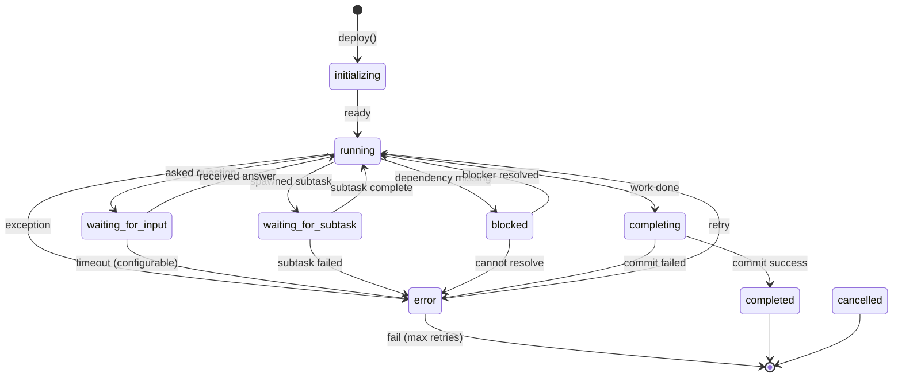

# Multi-Agent Orchestration System Tightening

## Overview

Transform the current multi-agent orchestration system from a loosely-coupled, assumption-based architecture into a production-grade, event-driven system with explicit state management, robust error recovery, autonomous agent decision-making, and fluent agent-to-agent collaboration.

**Vision**: An army of specialized agents working as a cohesive team where:
- Users are involved in **creative** and **architectural** decisions only
- **Execution** is fully autonomous with agents consulting each other
- The orchestrator is an intelligent coordinator, not a passive observer
- Workers explicitly signal their state rather than relying on timeout-based inference

## Problem Statement / Motivation

The current orchestration system has several critical issues that prevent production-grade autonomous operation:

### Critical Issues

1. **Idle = Completed Assumption**: When a worker goes idle, the orchestrator assumes completion. This is fundamentally wrong - the worker might be:
   - Waiting for user input (asked a question)
   - Waiting for subtask completion
   - Genuinely stuck
   - Completed but forgot to call completion tool

2. **Error Handling Blindness**: When workers encounter errors, the orchestrator isn't notified to make intelligent decisions (retry vs cancel vs escalate).

3. **Non-Blocking Message Delivery Failure**: When the orchestrator doesn't block on tasks, messages from workers may never reach it - the orchestrator "idles out" and becomes unresponsive.

4. **Passive Agents**: Agents only spawn subtasks when explicitly instructed, not when they recognize a task would benefit from specialist involvement.

5. **Search Over Navigation**: Despite providing symbolic navigation tools, agents default to inefficient search patterns.

6. **Worktree Path Chaos**: Worktree paths are sometimes incorrect, leading to file access issues and confused agents.

7. **Limited Agent Roles**: Only `@architect`, `@agent`, and `@reviewer` exist. Complex workflows need product, researcher, tester, and other specialized roles.

8. **No Agent-to-Agent Consultation**: Agents escalate to humans immediately instead of first consulting specialist agents who could answer their questions.

## Proposed Solution

A phased approach to tighten the orchestration system:

### Phase 1: Worker State Machine & Explicit Signaling
Implement explicit worker states with proper signaling mechanisms.

### Phase 2: Event-Driven Orchestrator
Transform orchestrator from passive observer to active coordinator with event-driven message processing.

### Phase 3: Error Recovery Framework
Implement intelligent error classification and recovery decision logic.

### Phase 4: Agent Autonomy & Delegation
Enable agents to autonomously spawn subtasks and consult specialists.

### Phase 5: Expanded Agent Roles
Define and implement additional specialized agent roles.

### Phase 6: Worktree & Navigation Enforcement
Hard-enforce worktree boundaries and symbolic navigation patterns.

---

## Technical Approach

### Architecture

```
┌─────────────────────────────────────────────────────────────────────────────┐
│                    ORCHESTRATOR (Event-Driven Coordinator)                   │
│  - State Machine Manager (tracks all worker states)                         │
│  - Error Recovery Engine (classifies errors, decides actions)               │
│  - Message Router (event-driven, never misses messages)                     │
│  - Agent Selector (recommends which agent role for each task)               │
└─────────────────────────────────────────────────────────────────────────────┘
                    ▲                                    │
                    │ Events (state changes, errors)     │ Commands (retry, cancel, message)
                    │                                    ▼
┌─────────────────────────────────────────────────────────────────────────────┐
│                      EVENT BUS (Pub/Sub with Guaranteed Delivery)           │
│  - worker.state_changed (idle → waiting_for_input, etc.)                    │
│  - worker.error (with error classification)                                 │
│  - worker.question (agent needs answer)                                     │
│  - worker.completion (explicit completion signal)                           │
│  - subtask.* (all subtask lifecycle events)                                 │
└─────────────────────────────────────────────────────────────────────────────┘
                    ▲                                    │
                    │ State signals                      │ Orchestrator commands
                    │                                    ▼
┌─────────────────────────────────────────────────────────────────────────────┐
│                     WORKER (Explicit State Signaler)                        │
│  - MUST signal state: running, waiting_for_input, waiting_for_subtask,     │
│    blocked, completing, completed, error                                    │
│  - CAN consult specialist agents before escalating to human                │
│  - SHOULD spawn subtasks for specialized work                               │
└─────────────────────────────────────────────────────────────────────────────┘
                    ▲                                    │
                    │ Consultation results               │ Consultation requests
                    │                                    ▼
┌─────────────────────────────────────────────────────────────────────────────┐
│                   SPECIALIST AGENTS (Consultation Pool)                      │
│  @product    - UX decisions, feature scoping, user perspective             │
│  @researcher - Codebase investigation, best practices, documentation       │
│  @architect  - System design, architectural decisions                       │
│  @reviewer   - Code quality, security review                                │
│  @tester     - Test strategy, test generation                               │
└─────────────────────────────────────────────────────────────────────────────┘
```

### Implementation Phases

---

## Phase 1: Worker State Machine & Explicit Signaling

**Objective**: Replace timeout-based idle detection with explicit state signaling from workers.

### New Worker States

```typescript
// orchestrator/orchestratorInterfaces.ts

type WorkerState =
  | 'initializing'      // Worker starting up
  | 'running'           // Actively executing (tool calls, thinking)
  | 'waiting_for_input' // Asked a question, waiting for user/orchestrator response
  | 'waiting_for_subtask' // Spawned subtask(s), waiting for completion
  | 'blocked'           // Cannot proceed (dependency, permission, etc.)
  | 'completing'        // Wrapping up, committing, finalizing
  | 'completed'         // Successfully finished (terminal)
  | 'error'             // Failed (terminal unless retried)
  | 'cancelled';        // User/orchestrator cancelled (terminal)

interface WorkerStateTransition {
  from: WorkerState;
  to: WorkerState;
  reason: string;
  timestamp: number;
  metadata?: {
    questionAsked?: string;        // If waiting_for_input
    subtaskIds?: string[];         // If waiting_for_subtask
    blockedBy?: string;            // If blocked
    error?: ErrorClassification;   // If error
  };
}
```

### State Signaling Tool

```typescript
// orchestrator/tools/a2aStateSignalTool.ts

/**
 * Tool for workers to explicitly signal their state to orchestrator.
 * CRITICAL: Workers MUST use this tool when their state changes.
 */
interface A2AStateSignalParams {
  /** New state the worker is entering */
  state: WorkerState;

  /** Human-readable reason for the state change */
  reason: string;

  /** If waiting_for_input: the question being asked */
  question?: string;

  /** If waiting_for_subtask: IDs of subtasks being awaited */
  awaitingSubtasks?: string[];

  /** If blocked: what is blocking progress */
  blockedBy?: string;

  /** If error: classification of the error */
  errorType?: 'transient' | 'permanent' | 'user_resolvable';
}
```

### Agent Instructions Update

Add to all agent `.agent.md` files:

```markdown
## State Signaling Requirements

You MUST signal your state changes using the `a2a_signal_state` tool:

1. **Before asking a question**: Signal `waiting_for_input` with your question
2. **After spawning subtasks**: Signal `waiting_for_subtask` with subtask IDs
3. **When blocked**: Signal `blocked` with what's blocking you
4. **Before completing**: Signal `completing` then call `a2a_subtask_complete`
5. **On error**: Signal `error` with the error classification

NEVER just go idle without signaling your state. The orchestrator needs to know
whether you're waiting for something or genuinely done.
```

### Tasks

1. [ ] Define `WorkerState` type with all states (`orchestratorInterfaces.ts`)
2. [ ] Create `WorkerStateTransition` interface for tracking transitions
3. [ ] Implement `a2a_signal_state` tool for explicit state signaling
4. [ ] Update `WorkerSession` to track state history
5. [ ] Modify `WorkerHealthMonitor` to use explicit states instead of timeouts
6. [ ] Update orchestrator event handling to respond to state signals
7. [ ] Add state signaling instructions to all agent `.agent.md` files
8. [ ] Create state machine diagram documentation

**Depends on**: None
**Success Criteria**:
- Workers explicitly signal state changes
- Orchestrator can distinguish waiting vs stuck vs completed
- No more timeout-based completion inference

---

## Phase 2: Event-Driven Orchestrator

**Objective**: Transform orchestrator from passive observer to active event-driven coordinator that never misses messages.

### Event Bus Architecture

```typescript
// orchestrator/eventBus.ts

interface OrchestratorEventBus {
  // Subscribe to events (guaranteed delivery)
  on<T extends OrchestratorEventType>(
    eventType: T,
    handler: (event: OrchestratorEventPayload<T>) => Promise<void>
  ): Disposable;

  // Emit events (persisted until handled)
  emit<T extends OrchestratorEventType>(
    eventType: T,
    payload: OrchestratorEventPayload<T>
  ): Promise<void>;

  // Process pending events (called on startup, periodically, and on new subscriptions)
  processPendingEvents(): Promise<void>;
}

type OrchestratorEventType =
  | 'worker.state_changed'
  | 'worker.question'
  | 'worker.error'
  | 'worker.completion'
  | 'subtask.spawned'
  | 'subtask.completed'
  | 'subtask.failed'
  | 'plan.task_ready'      // Dependencies satisfied, task can start
  | 'plan.completed'
  | 'consultation.request' // Agent wants to consult specialist
  | 'consultation.response';
```

### Guaranteed Message Delivery

```typescript
// orchestrator/orchestratorQueue.ts - ENHANCED

class OrchestratorQueue {
  /**
   * Register handler AND process any pending messages for this owner.
   * This fixes the non-blocking message delivery problem.
   */
  registerOwnerHandler(
    ownerId: string,
    handler: MessageHandler
  ): Disposable {
    this._handlers.set(ownerId, handler);

    // CRITICAL: Retroactively process any queued messages for this owner
    setImmediate(() => this._processPendingForOwner(ownerId));

    return { dispose: () => this._handlers.delete(ownerId) };
  }

  /**
   * Heartbeat that ensures messages are delivered even if no handler registered.
   * Runs every 1 second.
   */
  private _startHeartbeat(): void {
    this._heartbeatInterval = setInterval(() => {
      this._processAllPending();
    }, 1000);
  }
}
```

### Active Orchestration Loop

```typescript
// orchestrator/orchestratorServiceV2.ts - ENHANCED

class OrchestratorService {
  /**
   * Start active orchestration loop.
   * Unlike passive mode, this actively monitors and coordinates workers.
   */
  async startActiveOrchestration(planId: string): Promise<void> {
    // Subscribe to all relevant events
    this._eventBus.on('worker.state_changed', this._handleStateChange);
    this._eventBus.on('worker.question', this._handleWorkerQuestion);
    this._eventBus.on('worker.error', this._handleWorkerError);
    this._eventBus.on('worker.completion', this._handleWorkerCompletion);
    this._eventBus.on('consultation.request', this._handleConsultationRequest);

    // Deploy initial tasks
    await this._deployReadyTasks(planId);

    // Orchestrator stays active until plan completes
    // Events drive all coordination - no polling needed
  }

  private async _handleWorkerQuestion(event: WorkerQuestionEvent): Promise<void> {
    const { workerId, question, canBeAnsweredBy } = event;

    // Try to answer via specialist agent first
    if (canBeAnsweredBy) {
      const specialist = this._findSpecialist(canBeAnsweredBy);
      if (specialist) {
        const answer = await this._consultSpecialist(specialist, question);
        await this._sendMessageToWorker(workerId, answer);
        return;
      }
    }

    // Fall back to orchestrator knowledge or escalate to user
    await this._escalateQuestionToUser(workerId, question);
  }
}
```

### Tasks

1. [ ] Create `OrchestratorEventBus` with guaranteed delivery
2. [ ] Add heartbeat mechanism to `OrchestratorQueue` (every 1s)
3. [ ] Implement `registerOwnerHandler` with retroactive message processing
4. [ ] Create `startActiveOrchestration()` method for event-driven coordination
5. [ ] Add event handlers for all worker state changes
6. [ ] Persist event queue to survive VS Code restarts
7. [ ] Add orchestrator "wake-up" on any incoming event
8. [ ] Create integration tests for message delivery scenarios

**Depends on**: Phase 1
**Success Criteria**:
- Messages are NEVER lost in non-blocking mode
- Orchestrator responds to worker questions within 1 second
- Orchestrator wakes up on any event, never idles out

---

## Phase 3: Error Recovery Framework

**Objective**: Implement intelligent error classification and automated recovery decisions.

### Error Classification

```typescript
// orchestrator/errorClassification.ts

interface ErrorClassification {
  type: 'transient' | 'permanent' | 'user_resolvable' | 'infrastructure';
  category: ErrorCategory;
  retryable: boolean;
  maxRetries: number;
  retryStrategy: 'immediate' | 'exponential_backoff' | 'model_switch' | 'worktree_reset';
  escalateTo: 'orchestrator' | 'user' | 'none';
}

type ErrorCategory =
  // Transient - auto-retry
  | 'rate_limit'           // Model rate limit hit
  | 'network_timeout'      // Temporary network issue
  | 'service_unavailable'  // Backend temporarily down

  // Infrastructure - retry with reset
  | 'worktree_creation'    // Git worktree failed
  | 'git_conflict'         // Merge conflict
  | 'file_permission'      // Can't write to file

  // User-resolvable - escalate to user
  | 'authentication'       // Credentials invalid
  | 'missing_dependency'   // Required tool/package not installed
  | 'clarification_needed' // Ambiguous requirements

  // Permanent - don't retry
  | 'context_length'       // Prompt too long (needs restructuring)
  | 'invalid_task'         // Task fundamentally impossible
  | 'depth_limit'          // Can't spawn more subtasks
  | 'budget_exceeded';     // Cost limit reached

function classifyError(error: Error, context: WorkerContext): ErrorClassification {
  // Pattern matching on error message and type
  if (error.message.includes('rate limit')) {
    return {
      type: 'transient',
      category: 'rate_limit',
      retryable: true,
      maxRetries: 5,
      retryStrategy: 'exponential_backoff',
      escalateTo: 'none'
    };
  }

  if (error.message.includes('worktree') || error.message.includes('git')) {
    return {
      type: 'infrastructure',
      category: 'worktree_creation',
      retryable: true,
      maxRetries: 3,
      retryStrategy: 'worktree_reset',
      escalateTo: 'orchestrator'
    };
  }

  // ... more classifications
}
```

### Recovery Decision Engine

```typescript
// orchestrator/errorRecovery.ts

class ErrorRecoveryEngine {
  private _retryCounters = new Map<string, number>();

  async handleError(
    taskId: string,
    error: Error,
    context: WorkerContext
  ): Promise<RecoveryAction> {
    const classification = classifyError(error, context);
    const retryCount = this._retryCounters.get(taskId) || 0;

    // Check retry limit
    if (retryCount >= classification.maxRetries) {
      return this._escalate(taskId, error, classification);
    }

    // Execute recovery strategy
    switch (classification.retryStrategy) {
      case 'immediate':
        return { action: 'retry', delay: 0 };

      case 'exponential_backoff':
        const delay = Math.min(1000 * Math.pow(2, retryCount), 60000);
        return { action: 'retry', delay };

      case 'model_switch':
        return { action: 'retry', switchModel: this._selectFallbackModel() };

      case 'worktree_reset':
        await this._resetWorktree(context.worktreePath);
        return { action: 'retry', delay: 1000 };
    }
  }

  private async _escalate(
    taskId: string,
    error: Error,
    classification: ErrorClassification
  ): Promise<RecoveryAction> {
    if (classification.escalateTo === 'user') {
      // Show user-friendly error with suggested actions
      return {
        action: 'escalate_to_user',
        message: this._formatUserMessage(error, classification),
        suggestedActions: this._getSuggestedActions(classification)
      };
    }

    // Terminal failure
    return { action: 'fail', error };
  }
}
```

### Tasks

1. [ ] Create `ErrorClassification` interface and `classifyError()` function
2. [ ] Define all error categories with retry strategies
3. [ ] Implement `ErrorRecoveryEngine` with decision logic
4. [ ] Add retry counting per task
5. [ ] Implement exponential backoff with jitter
6. [ ] Add model switching capability for rate limits
7. [ ] Create worktree reset functionality for git errors
8. [ ] Implement user escalation with suggested actions
9. [ ] Add error classification tests for all categories

**Depends on**: Phase 2
**Success Criteria**:
- Transient errors auto-retry with backoff
- Infrastructure errors trigger worktree reset
- User-resolvable errors show clear guidance
- Permanent errors fail gracefully with explanation

---

## Phase 4: Agent Autonomy & Delegation

**Objective**: Enable agents to autonomously decide when to spawn subtasks and consult specialists.

### Autonomous Subtask Decision Framework

```typescript
// orchestrator/autonomyFramework.ts

interface SubtaskDecisionCriteria {
  /** Spawn subtask if task requires different expertise */
  requiresDifferentExpertise: boolean;

  /** Spawn subtask if task can be parallelized */
  canBeParallelized: boolean;

  /** Spawn subtask if task is outside agent's core competency */
  outsideCoreCompetency: boolean;

  /** Spawn subtask if specialist would be 3x+ faster */
  specialistWouldBeFaster: boolean;

  /** Spawn subtask if task needs dedicated worktree isolation */
  needsWorktreeIsolation: boolean;
}

const SUBTASK_DECISION_RULES = {
  // Always spawn for these patterns
  '@architect': ['design API', 'plan architecture', 'system design'],
  '@reviewer': ['review code', 'security audit', 'check for bugs'],
  '@tester': ['write tests', 'test strategy', 'generate test cases'],
  '@researcher': ['find examples', 'check best practices', 'investigate codebase'],
  '@product': ['user experience', 'feature requirements', 'prioritization'],
};
```

### Agent Consultation Protocol

```typescript
// orchestrator/consultation.ts

interface ConsultationRequest {
  /** Agent requesting consultation */
  requestingAgentId: string;

  /** Type of specialist needed */
  specialistType: AgentRole;

  /** Question or context for consultation */
  query: string;

  /** Expected response format */
  expectedResponse: 'answer' | 'decision' | 'review' | 'options';

  /** Maximum back-and-forth turns allowed */
  maxTurns: number;

  /** Whether to block until consultation completes */
  blocking: boolean;
}

interface ConsultationResult {
  specialistResponse: string;
  confidence: 'high' | 'medium' | 'low';
  suggestedAction?: string;
  needsHumanInput: boolean;
}
```

### Agent Instructions for Autonomy

Add to agent `.agent.md` files:

```markdown
## Autonomous Delegation Guidelines

You have the authority to spawn subtasks and consult specialists WITHOUT asking for permission.
Use this power wisely to deliver better results faster.

### ALWAYS spawn a subtask when:
- Task requires architectural decisions → spawn @architect
- Code needs review before completion → spawn @reviewer
- Tests need to be written → spawn @tester
- You need codebase context → spawn @researcher
- Product/UX decisions needed → spawn @product

### ALWAYS consult a specialist before:
- Making architectural decisions (consult @architect)
- Implementing user-facing features (consult @product)
- Merging code (consult @reviewer)

### Consultation vs Subtask:
- **Consultation**: Quick question, get answer, continue your work
- **Subtask**: Delegate significant work to specialist, await results

### Example consultation:
```
I need to decide between REST and GraphQL for this API.
<a2a_consult specialist="@architect" query="Should this API use REST or GraphQL given the requirements for real-time updates and mobile clients?"/>
```

### Example subtask:
```
This feature needs a comprehensive test suite.
<a2a_spawn_subtask agent="@tester" prompt="Write comprehensive tests for the UserAuthentication module including unit, integration, and edge case tests"/>
```
```

### Tasks

1. [ ] Define `SubtaskDecisionCriteria` and decision rules
2. [ ] Create `a2a_consult` tool for quick specialist consultations
3. [ ] Implement `ConsultationProtocol` with multi-turn support
4. [ ] Update agent instructions with autonomy guidelines
5. [ ] Add specialist routing logic to orchestrator
6. [ ] Create consultation result caching to avoid duplicate queries
7. [ ] Implement consultation timeout and fallback to human
8. [ ] Add autonomy metrics (how often agents delegate, success rate)

**Depends on**: Phase 3
**Success Criteria**:
- Agents proactively spawn subtasks for specialized work
- Agents consult specialists before major decisions
- Human escalation only for truly creative/architectural decisions
- 80%+ of technical questions answered by agent consultation

---

## Phase 5: Expanded Agent Roles

**Objective**: Define and implement additional specialized agent roles for comprehensive team coverage.

### New Agent Roles

#### @product (Product Agent)

```markdown
# Product Agent

## Role
You are a product expert who helps with UX decisions, feature scoping, and user perspective analysis.

## Core Competencies
- User experience design decisions
- Feature prioritization and scoping
- User story refinement
- Accessibility considerations
- User-facing copy and messaging

## Tools
- user_story_analyzer
- competitor_analysis
- accessibility_checker
- copy_reviewer

## When to Consult @product
- Designing user-facing interfaces
- Writing error messages or UI copy
- Deciding between feature approaches based on UX
- Accessibility requirements
- Feature scope decisions

## Decision Authority
- UX design patterns: DECIDE
- Feature scope: RECOMMEND (human approves)
- User-facing copy: DECIDE (within brand guidelines)
- Accessibility requirements: DECIDE (mandatory compliance)
```

#### @researcher (Codebase Researcher)

```markdown
# Researcher Agent

## Role
You are a codebase research expert who investigates existing code, finds examples, and gathers context using SYMBOLIC NAVIGATION (not search).

## Core Competencies
- Following import chains to understand dependencies
- Reading documentation and README files
- Finding existing patterns and conventions
- Investigating how features are implemented
- Gathering best practices from codebase

## Tools
- navigate_imports (follow import statements)
- read_documentation (README, docs/, CLAUDE.md)
- find_implementations (locate where interfaces are implemented)
- trace_data_flow (follow data through the codebase)

## CRITICAL: Symbolic Navigation
You MUST use symbolic navigation instead of grep/search:
- Follow imports: `import { X } from './module'` → read `./module`
- Check package.json for dependencies
- Read type definitions to understand interfaces
- Follow class hierarchies through extends/implements

## When to Consult @researcher
- Need to understand how something works in codebase
- Looking for existing patterns to follow
- Need context about project conventions
- Investigating dependencies and their usage
```

#### @tester (Test Agent)

```markdown
# Tester Agent

## Role
You are a testing expert who designs test strategies, writes comprehensive tests, and ensures code quality through testing.

## Core Competencies
- Test strategy design
- Unit test generation
- Integration test design
- Edge case identification
- Test coverage analysis

## Tools
- test_generator (creates test skeletons)
- coverage_analyzer (identifies untested code paths)
- edge_case_finder (suggests edge cases to test)
- test_runner (executes tests and reports results)

## Test Hierarchy
1. Unit tests for all public functions
2. Integration tests for module boundaries
3. E2E tests for critical user flows
4. Edge case tests for error conditions

## When to Consult @tester
- Before marking implementation complete
- When unsure about test coverage
- For complex edge case identification
- Test strategy for new features
```

### Tasks

1. [ ] Create `Product.agent.md` with full role definition
2. [ ] Create `Researcher.agent.md` with symbolic navigation emphasis
3. [ ] Create `Tester.agent.md` with test strategy framework
4. [ ] Implement role-specific tools for each agent
5. [ ] Add agent discovery to `orchestrator_listAgents`
6. [ ] Create agent capability matrix documentation
7. [ ] Implement agent recommendation engine (suggest role for task)
8. [ ] Add role-based permission defaults

**Depends on**: Phase 4
**Success Criteria**:
- All five agent roles operational (@architect, @agent, @reviewer, @product, @researcher, @tester)
- Each role has clear competencies and tools
- Orchestrator can recommend appropriate agent for any task
- Agents can discover and utilize all available roles

---

## Phase 6: Worktree & Navigation Enforcement

**Objective**: Hard-enforce worktree boundaries and symbolic navigation patterns.

### Worktree Path Enforcement

```typescript
// orchestrator/worktreeEnforcer.ts

class WorktreeEnforcer {
  /**
   * Validate that a file path is within the allowed worktree.
   * Called by ALL file operation tools before execution.
   */
  validatePath(
    requestedPath: string,
    worktreePath: string,
    operation: 'read' | 'write' | 'delete'
  ): ValidationResult {
    const normalizedRequested = path.resolve(requestedPath);
    const normalizedWorktree = path.resolve(worktreePath);

    // Must be within worktree
    if (!normalizedRequested.startsWith(normalizedWorktree)) {
      return {
        valid: false,
        error: `Access denied: ${operation} operation outside worktree boundary`,
        suggestion: `File must be within: ${worktreePath}`
      };
    }

    // Additional checks for sensitive paths
    if (this._isSensitivePath(normalizedRequested)) {
      return {
        valid: false,
        error: 'Access denied: sensitive file',
        suggestion: 'Cannot modify .git, node_modules, or system files'
      };
    }

    return { valid: true };
  }
}
```

### Symbolic Navigation Tools

```typescript
// orchestrator/tools/symbolicNavigationTools.ts

/**
 * Navigate to a symbol by following imports.
 * This is the PREFERRED way to explore code - NOT grep/search.
 */
interface NavigateImportsParams {
  /** Starting file */
  startFile: string;

  /** Symbol to find (function, class, type name) */
  symbolName: string;

  /** Maximum depth to follow imports */
  maxDepth?: number;
}

/**
 * Find where an interface/type is implemented.
 * Follows type hierarchy, not text search.
 */
interface FindImplementationsParams {
  /** Interface or abstract class name */
  typeName: string;

  /** Starting directory (defaults to src/) */
  startDir?: string;
}

/**
 * Trace data flow through the codebase.
 * Follows function calls and data transformations.
 */
interface TraceDataFlowParams {
  /** Starting point (function or variable) */
  startSymbol: string;

  /** Direction to trace */
  direction: 'forward' | 'backward' | 'both';
}
```

### Search Tool Deprecation

```typescript
// orchestrator/tools/deprecatedTools.ts

/**
 * DEPRECATED: Use navigate_imports, find_implementations, or trace_data_flow instead.
 *
 * This tool is kept for backward compatibility but will warn agents to use
 * symbolic navigation tools instead.
 */
async function search_files(params: SearchParams): Promise<SearchResult> {
  this._logService.warn(
    '[DEPRECATION] search_files is deprecated. Use symbolic navigation tools instead.'
  );

  // Return results but include warning in output
  const results = await this._doSearch(params);
  return {
    ...results,
    warning: 'Consider using navigate_imports or find_implementations for more precise results'
  };
}
```

### Worktree Path Construction Fix

```typescript
// orchestrator/worktreeManager.ts

class WorktreeManager {
  /**
   * Create a properly constructed worktree path.
   * Fixes the "weird worktree path" issue.
   */
  async createWorktree(options: CreateWorktreeOptions): Promise<string> {
    const { planId, taskId, taskName } = options;

    // Sanitize task name for path safety
    const sanitizedName = this._sanitizeForPath(taskName || taskId);

    // Construct deterministic, readable path
    // Format: ../.orchestrator-worktrees/<planId>/<sanitizedTaskName>
    const workspaceRoot = this._getWorkspaceRoot();
    const worktreesRoot = path.join(workspaceRoot, '..', '.orchestrator-worktrees');
    const planDir = planId || 'adhoc';
    const worktreePath = path.join(worktreesRoot, planDir, sanitizedName);

    // Ensure parent directories exist
    await fs.mkdir(path.dirname(worktreePath), { recursive: true });

    // Create worktree with proper branch naming
    const branchName = `orchestrator/${planDir}/${sanitizedName}`;
    await this._execGit(['worktree', 'add', '-b', branchName, worktreePath, 'HEAD']);

    // Validate worktree was created correctly
    const validation = await this._validateWorktree(worktreePath);
    if (!validation.valid) {
      throw new Error(`Worktree validation failed: ${validation.error}`);
    }

    return worktreePath;
  }

  private _sanitizeForPath(name: string): string {
    return name
      .toLowerCase()
      .replace(/[^a-z0-9-]/g, '-')  // Replace non-alphanumeric with dash
      .replace(/-+/g, '-')          // Collapse multiple dashes
      .replace(/^-|-$/g, '')        // Remove leading/trailing dashes
      .slice(0, 50);                // Limit length
  }
}
```

### Tasks

1. [ ] Implement `WorktreeEnforcer` with path validation
2. [ ] Add path validation to ALL file operation tools
3. [ ] Create `navigate_imports` tool for following import chains
4. [ ] Create `find_implementations` tool for type hierarchy navigation
5. [ ] Create `trace_data_flow` tool for data flow analysis
6. [ ] Add deprecation warnings to search tools
7. [ ] Fix worktree path construction with deterministic naming
8. [ ] Add worktree validation after creation
9. [ ] Create worktree cleanup on plan completion
10. [ ] Update agent instructions to prefer symbolic navigation

**Depends on**: None (can run in parallel with other phases)
**Success Criteria**:
- Zero file operations outside worktree boundary
- Agents use symbolic navigation 80%+ of the time
- Worktree paths are predictable and readable
- Worktrees are properly cleaned up

---

## Alternative Approaches Considered

### 1. Polling vs Event-Driven

**Considered**: Polling workers every N seconds for status
**Rejected**: Creates unnecessary load, introduces latency, doesn't scale
**Chosen**: Event-driven with explicit state signaling - workers tell us their state

### 2. Implicit vs Explicit Completion

**Considered**: Keep timeout-based completion inference
**Rejected**: Too error-prone, can't distinguish waiting vs stuck vs done
**Chosen**: Explicit completion signals with state machine

### 3. Single Orchestrator vs Distributed Coordination

**Considered**: Multiple orchestrators for different plan types
**Rejected**: Adds complexity, coordination overhead
**Chosen**: Single event-driven orchestrator with specialist agents

### 4. Human-First vs Agent-First Consultation

**Considered**: Always escalate questions to humans
**Rejected**: Slows down execution, humans become bottleneck
**Chosen**: Agent-to-agent consultation first, human only for creative/architectural

---

## Acceptance Criteria

### Functional Requirements

- [ ] Workers signal state changes within 100ms of state change
- [ ] Orchestrator responds to worker questions within 1 second
- [ ] Non-blocking mode delivers 100% of messages
- [ ] Transient errors auto-retry with exponential backoff
- [ ] Agents autonomously spawn subtasks for specialized work
- [ ] All 6 agent roles are operational with distinct competencies
- [ ] File operations are blocked outside worktree boundaries
- [ ] Symbolic navigation tools are available and preferred

### Non-Functional Requirements

- [ ] Event processing latency < 100ms
- [ ] Message queue can handle 1000+ messages
- [ ] Worktree creation < 5 seconds
- [ ] Error classification accuracy > 95%
- [ ] Zero lost messages in non-blocking mode

### Quality Gates

- [ ] Unit tests for all error classifications
- [ ] Integration tests for state machine transitions
- [ ] E2E tests for full orchestration flows
- [ ] Performance benchmarks for event processing
- [ ] Documentation for all agent roles and tools

---

## Success Metrics

| Metric | Current | Target |
|--------|---------|--------|
| Messages lost in non-blocking mode | Unknown (>0) | 0 |
| Time to detect stuck worker | 5 minutes | < 10 seconds |
| Auto-recovered transient errors | 0% | > 90% |
| Agent-to-agent consultation rate | 0% | > 50% |
| Symbolic navigation usage | ~20% | > 80% |
| Human escalations per plan | Many | < 3 creative/architectural |

---

## Dependencies & Prerequisites

### Technical Dependencies
- VS Code Extension API (workspace, terminals)
- Git CLI (worktree management)
- Claude Agent SDK (agent execution)
- Node.js EventEmitter (event bus)

### Team Dependencies
- Agent prompt engineering for state signaling instructions
- UX design for error escalation messages

### Infrastructure
- Persistent storage for event queue
- File system access for worktree management

---

## Risk Analysis & Mitigation

| Risk | Impact | Probability | Mitigation |
|------|--------|-------------|------------|
| State signaling forgotten by agents | High | Medium | Enforce in tool layer, add reminders |
| Event queue grows unbounded | Medium | Low | Add queue size limits, TTL for old events |
| Agent consultation loops | High | Medium | Add max consultation depth, loop detection |
| Worktree path conflicts | Medium | Medium | Use UUIDs in paths, validate before creation |
| Backward compatibility breakage | Medium | High | Feature flags for gradual rollout |

---

## Future Considerations

### Short-Term (Next Quarter)
- Add cost budget enforcement per plan
- Implement conversation history summarization for long tasks
- Add support for Claude backend agents

### Medium-Term (6 months)
- Multi-model orchestration (use cheapest model that works)
- Cross-workspace agent collaboration
- Plugin system for custom agent roles

### Long-Term (1 year)
- Self-improving agents (learn from failures)
- Distributed orchestration across machines
- Natural language plan definition

---

## References & Research

### Internal References
- `src/extension/orchestrator/orchestratorServiceV2.ts` - Main orchestrator service
- `src/extension/orchestrator/subTaskManager.ts` - Subtask lifecycle management
- `src/extension/orchestrator/orchestratorQueue.ts` - Message queue implementation
- `src/extension/orchestrator/workerHealthMonitor.ts` - Current health monitoring

### External References
- [LangGraph Multi-Agent Orchestration](https://docs.langchain.com/oss/python/langchain/multi-agent) - State machine patterns
- [MetaGPT Architecture](https://arxiv.org/html/2308.00352v6) - SOP-driven agent roles
- [Event-Driven Multi-Agent Systems](https://www.confluent.io/blog/event-driven-multi-agent-systems/) - Event bus patterns

### Related Work
- Current architecture documentation in `.github/copilot-instructions.md`
- Agent definitions in `.agent.md` files
- Orchestrator interfaces in `orchestratorInterfaces.ts`

---

## ERD: State Machine


